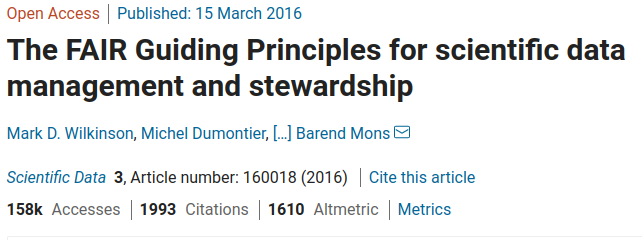
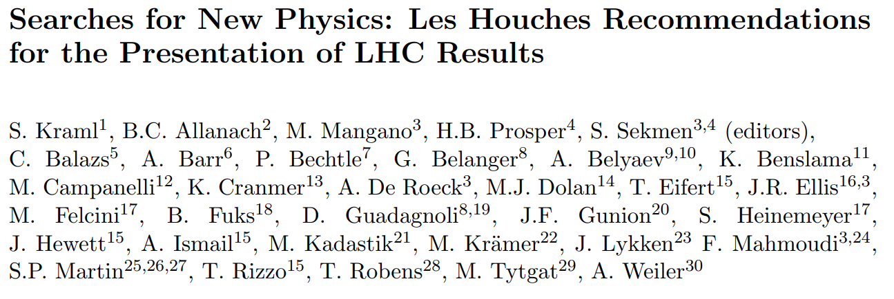
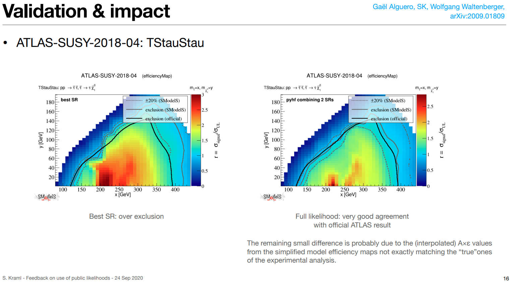

class: middle, center, title-slide
count: false

# Modern Tools for
# Reusable Publications and Data Products

.huge.blue[Matthew Feickert] 
.huge[(University of Illinois at Urbana-Champaign)]
  
[matthew.feickert@cern.ch](mailto:matthew.feickert@cern.ch)

[LPSC Grenoble Colloquium](https://lpsc-indico.in2p3.fr/event/2585/)

November 26th, 2020

.middle-logo[]

<!-- ---
# Abstract

 In the modern scientific landscape the publication of results through papers alone is often insufficient for the rapid spread and adoption of new ideas and techniques. Publication of openly available, versioned, and citable code and data products, in addition to papers, provides important reusable tooling that can significantly increase the impact of authors' work. Building on the ideas of FAIR data practices and Open is Not Enough (2018), I will highlight how these ideas and tools are enabling new physics results at the LHC and improved collaboration across physics. I will additionally explore how these open tools can be readily integrated into your scientific toolbox and argue they can be easily leveraged to improve the spread of work.

 - Time goal: Approximately 45 minutes + 15 minutes for questions
 - Refer to [Anja Butter's nice talk](https://lpsc-indico.in2p3.fr/event/2536/) for example -->

---
# Collaborators

.grid[
.kol-1-3.center[
.circle.width-40[]

[Lukas Heinrich](https://github.com/lukasheinrich)

CERN
]
.kol-1-3.center[
.circle.width-40[]

[Giordon Stark](https://github.com/kratsg)

UCSC SCIPP
]
.kol-1-3.center[
.circle.width-35[]

[Kyle Cranmer](http://theoryandpractice.org/)

NYU
]
]
.grid[
.kol-1-4.center[
.circle.width-45[]

[Mark Neubauer](https://github.com/lukasheinrich)

Illinois
]
.kol-1-4.center[
.circle.width-45[]

[Sabine Kraml](http://www.kraml.net/)

LPSC, Grenoble
]
.kol-1-4.center[
.circle.width-45[]

[Wolfgang Waltenberger](https://github.com/WolfgangWaltenberger)

HEPHY ÖAW
]
.kol-1-4.center[
.circle.width-45[]

[Gaël Alguero](https://github.com/Ga0l)

LPSC, Grenoble
]
]

---
class: focus-slide, center
# Goals for today's discussion

.huge.center.bold[Open and reusable data products are valuable to everyone, especially you!]
 
 
 
.huge.center.bold[Show live (toy) example of how easy it can be to get started]

---
# Goals of physics analysis at the LHC

.kol-1-1[
.kol-1-3.center[
.width-100[]
Search for new physics
]
.kol-1-3.center[
 
.width-100[]

 
Make precision measurements
]
.kol-1-3.center[
.width-110[]

Provide constraints on models through setting best limits
]
]

- The results of these analyses are .bold[data products] (plots, tables, likelihoods)
- For these data products to be useful need to be .bold[shared] and .bold[reusable] with experiments and theory
- Requires the data products to be archived, easily findable, and machine readable (and human understandable)

---
# Easy, just make them open...?

.kol-1-2[
 
- Making data products open is a great first start, but .bold[not enough]!
- Experiments are complex and code and workflows are complicated
- If just the code and data were made public, would be .bold[largely useless] to anyone but the authors
- For data products to be useful they  need to be able to be .bold[understood] and used by the scientific community
   - Relationship of the data and the analysis needs to be made clear/available as well
]
.kol-1-2.width-100[
.width-100[]
  
  
.width-100[]
]

---
# ...other extreme: Preserving analyses in full

.center[Ideally preserve the .italic[entire] analysis workflow]

.kol-2-5[
- [RECAST](https://inspirehep.net/literature/872781), [REANA](https://www.reanahub.io/): Reproducible research data analysis platform
   - Infrastructure for lossless analysis preservation
   1. Capture software
   2. Capture commands
   3. Capture workflow
- This is .italic[great] for the LHC experiments (pioneered in ATLAS), but requires huge amounts of resources
   - Hard to scale out for everyone in science
   - Currently still an internal service for CERN
- While the LHC experiments are making this a standard what can be done .emph[now]?
]
.kol-3-5[
.center.width-75[]
.center[REANA computational workflow for a]
.center[beyond the Standard Model (BSM) full analysis]
]

---
# Making data products [FAIR](https://www.go-fair.org/fair-principles/)

.kol-1-2[
- For data products to be useful they should follow .bold[FAIR] principles
- .bold[F]indable: Metadata and data should be easy to find for both humans and computers.
   - Unique persistent identifier (digital object identifier ([DOI](https://en.wikipedia.org/wiki/Digital_object_identifier))) and rich metadata
- .bold[A]ccessible: Retrievable by identifier using a standardised communications protocol
   - HTTPS, public APIs
- .bold[I]nteroperable: Interoperate with applications or workflows for analysis, storage, and processing
   - Schemas and serialization
   - Formal, shared, broadly applicable
- .bold[R]euseable: Well-described so can be replicated and/or combined in different settings
   - Annotated metadata ([Codemeta JSON-LD](https://codemeta.github.io/jsonld/))
]
.kol-1-2.center[
.width-100[]
  
.width-100[]
  
.center[Large interest in FAIR data across all levels]
]

---
class: focus-slide, center
# Case study:
# publishing LHC experiment full likelihoods

 
.center.width-50[]

---
# Why is the likelihood important?

.kol-1-2.width-90[
 
- High information-density summary of analysis
- Almost everything we do in the analysis ultimately affects the likelihood and is encapsulated in it
   - Trigger
   - Detector
   - Combined Performance / Physics Object Groups
   - Systematic Uncertainties
   - Event Selection
- Unique representation of the analysis to reuse and preserve
]
.kol-1-2.width-100[
  

]

---
# Importance of public likelihoods

.grid[
.kol-1-2[
 
- The statistical model of an experimental analysis provides the .bold[complete mathematical description of that analysis]
   - $p\left(x|\vec{\alpha}\right)$ relating the observed quantities $x$ to the parameters $\vec{\alpha}$
- Given the likelihood, can employ standard statistical approaches for .bold[extracting information] from it
- .bold[Essential information] for any detailed interpretation of experimental results
   - Determining the .italic[compatibility of theoretical predictions with the observations]!
]
.kol-1-2[
- Requested in [Les Houches Recommendations (2012)](https://arxiv.org/abs/1203.2489)
- .bold[3b:] When feasible, **provide a mathematical description of the final likelihood** function in which experimental data and parameters are clearly distinguished, either in the publication or the auxiliary information.
Limits of validity should always be clearly specified.
- .bold[3c:] Additionally **provide a digitized implementation of the likelihood** that is consistent with the mathematical description.
  
.center.width-100[]
]
]
.footnote[Slide from Sabine Kraml, [Feedback on use of public Likelihoods](https://indico.cern.ch/event/957797/contributions/4026032/), 24 September 2020]

---
# Partial likelihoods already published/preserved

.kol-1-2[
.center.width-95[]
.center[([CMS, 2017](https://cds.cern.ch/record/2242860))]
]
.kol-1-2[
 
 
.center.width-100[]
.center[CERN Analysis Preservation implements FAIR data]

.center[([CERN, CHEP 2019](https://indico.cern.ch/event/773049/contributions/3476165/))]
]

---
# Full likelihood serialization...

.center[...making good on [19 year old agreement to publish likelihoods](https://indico.cern.ch/event/746178/contributions/3396797/)]

.center.width-90[

]

.center[([1st Workshop on Confidence Limits, CERN, 2000](http://inspirehep.net/record/534129))]

.bold[This hadn't been done in HEP until 2019]
- In an "open world" of statistics this is a difficult problem to solve
- What to preserve and how? All of ROOT?
- Idea: Focus on a single more tractable binned model first

---
# Enter HistFactory and `pyhf`

$$
f\left(\mathrm{data}\middle|\mathrm{parameters}\right) =  f\left(\vec{n}, \vec{a}\middle|\vec{\eta}, \vec{\chi}\right) = \color{blue}{\prod\_{c \\,\in\\, \textrm{channels}} \prod\_{b \\,\in\\, \textrm{bins}\_c} \textrm{Pois} \left(n\_{cb} \middle| \nu\_{cb}\left(\vec{\eta}, \vec{\chi}\right)\right)} \\,\color{red}{\prod\_{\chi \\,\in\\, \vec{\chi}} c\_{\chi} \left(a\_{\chi}\middle|\chi\right)}
$$

.bold[Use:] Multiple disjoint _channels_ (or regions) of binned distributions with multiple _samples_ contributing to each with additional (possibly shared) systematics between sample estimates

.center[HistFactory is used ubiquitously in binned analyses]
.center[Focus on this flexible p.d.f. template rather than "open world" of models]
.center[.bold[This is a _mathematical_ representation!] Nowhere is any software spec defined]

.bold[`pyhf`: HistFactory in pure Python hardware accelerated with autodiff]  ([how to cite](https://scikit-hep.org/pyhf/citations.html#citation))
.kol-3-5[
.width-40[]
.width-55[]
]
.kol-2-5[
.grid[
.kol-1-3.center[
.circle.width-80[]

.center[[Lukas Heinrich](https://github.com/lukasheinrich)]

CERN
]
.kol-1-3.center[
.circle.width-80[]

.center[[Matthew Feickert](https://www.matthewfeickert.com/)]

Illinois
]
.kol-1-3.center[
.circle.width-70[]

.center[[Giordon  Stark](https://github.com/kratsg)]

UCSC SCIPP
]
]
]

---
# JSON spec fully describes the HistFactory model

.kol-1-4.width-100[
- Human & machine readable .bold[declarative] statistical models
- Industry standard
   - Will be with us forever
- Parsable by every language
   - Highly portable
   - Bidirectional translation  with ROOT
- Versionable and easily preserved
   - JSON Schema [describing  HistFactory specification](https://scikit-hep.org/pyhf/likelihood.html#bibliography)
   - Attractive for analysis preservation
   - Highly compressible
]
.kol-3-4.center[
.width-105[]

.center[[`JSON` defining a single channel, two bin counting experiment with systematics](https://scikit-hep.org/pyhf/likelihood.html#toy-example)]
]

---
# ATLAS validation and publication of likelihoods

.kol-1-2[
.center.width-100[]

.center.width-90[]

 
.center[(ATLAS, 2019)]
]
.kol-1-2[
.center.width-100[]
.center[(CERN, 2020)]
]

---
# JSON Patch for signal model (reinterpretation)
<!--  -->
.center[JSON Patch gives ability to .bold[easily mutate model]]
.center[Think: test a .bold[new theory] with a .bold[new patch]!]
.center[(c.f. [Lukas Heinrich's RECAST talk from Snowmass 2021 Computational Frontier Workshop](https://indico.fnal.gov/event/43829/contributions/193817/))]
 
.center[Combined with RECAST gives powerful tool for .bold[reinterpretation studies]]
<!--  -->
.kol-1-5[
 
 
 
 
.center.width-100[]
.center[Signal model A]
]
.kol-3-5[
<!-- Using Perl style in Carbon -->
.center.width-100[]
]
.kol-1-5[
 
 
 
 
.center.width-100[]
.center[Signal model B]
]

---
<!-- # HEPData -->
.center[
.width-40[]
]
.kol-1-3[
- Repository for publication-related High-Energy Physics data
- Allows for publication of data products that accompany papers
   - Extract values for Figures and Tables
   - Serializations in common formats
   - Associated DOI
- Vital resource in the collaboration cycle between experiment and theory
]
.kol-2-3[
.width-100[]
]

---
# Likelihoods preserved on HEPData

- `pyhf` pallet:
   - Background-only model JSON stored
   - Hundreds of signal model JSON Patches stored together as a [`pyhf` "patch set" file](https://scikit-hep.org/pyhf/_generated/pyhf.patchset.PatchSet.html)
- Fully preserve and publish the full statistical model and observations to give likelihood
   - with own DOI! .width-20[]

.kol-3-5[
[.center.width-100[]](https://www.hepdata.net/record/ins1755298)
]
.kol-2-5[
 
.center.width-85[]
]

---
# ...can be used from HEPData

- `pyhf` pallet:
   - Background-only model JSON stored
   - Hundreds of signal model JSON Patches stored together as a [`pyhf` "patch set" file](https://scikit-hep.org/pyhf/_generated/pyhf.patchset.PatchSet.html)
- Fully preserve and publish the full statistical model and observations to give likelihood
   - with own DOI! .width-20[]

.center.width-90[]

---
# Rapid adoption in ATLAS...
<!--  -->
.kol-1-3[
- **Five** ATLAS analyses with full likelihoods published to HEPData
- ATLAS SUSY will be continuing to publish full Run 2 likelihoods
- More FAIR than traditional ROOT workspaces
]
.kol-2-3[
- direct staus, [doi:10.17182/hepdata.89408](https://doi.org/10.17182/hepdata.89408) (2019)
- sbottom multi-b, [doi:10.17182/hepdata.91127](https://doi.org/10.17182/hepdata.91127) (2019)
- 1Lbb, [doi:10.17182/hepdata.92006](https://doi.org/10.17182/hepdata.92006) (2019)
- 3L eRJR, [doi:10.17182/hepdata.90607](https://doi.org/10.17182/hepdata.90607) (2020)
- ss3L search, [doi:10.17182/hepdata.91214](https://doi.org/10.17182/hepdata.91214) (2020)
]
.grid[
.kol-1-2.center[
.width-60[]
]
.kol-1-2.center[
.width-60[]
]
]
.center.smaller[SUSY [EWK 3L RPV](https://atlas.cern/updates/physics-briefing/fantastic-decays-and-where-find-them) analysis ([ATLAS-CONF-2020-009](https://atlas.web.cern.ch/Atlas/GROUPS/PHYSICS/CONFNOTES/ATLAS-CONF-2020-009/)): Exclusion curves as a function of mass and branching fraction to $Z$ bosons]

---
# ...and by theory

.kol-1-3[
- `pyhf` likelihoods discussed in
   - [Les Houches 2019 Physics at TeV Colliders: New Physics Working Group Report](https://inspirehep.net/literature/1782722)
   - [Higgs boson potential at colliders: status and perspectives](https://inspirehep.net/literature/1757043)
- [SModelS](https://smodels.github.io/) team has implemented a `SModelS`/`pyhf` interface [[arXiv:2009.01809](https://inspirehep.net/literature/1814793)]
   - tool for interpreting simplified-model results from the LHC
   - designed to be used by theorists
   - `SModelS` authors gave [tutorial at TOOLS 2020 workshop](https://indico.cern.ch/event/955391/contributions/4084223/)
]
.kol-2-3[
.center.width-100[]
.center.smaller[[Feedback on use of public Likelihoods](https://indico.cern.ch/event/957797/contributions/4026032/), Sabine Kraml (ATLAS Exotics + SUSY Reinterpretations Workshop)]
<!--  -->
]
- Have produced three comparisons to published ATLAS likelihoods: [ATLAS-SUSY-2018-04](https://atlas.web.cern.ch/Atlas/GROUPS/PHYSICS/PAPERS/SUSY-2018-04/), [ATLAS-SUSY-2018-31](https://atlas.web.cern.ch/Atlas/GROUPS/PHYSICS/PAPERS/SUSY-2018-31/), [ATLAS-SUSY-2019-08](https://atlas.web.cern.ch/Atlas/GROUPS/PHYSICS/PAPERS/SUSY-2019-08/)
   - Compare simplified likelihood (bestSR) to full likelihood (`pyhf`) using `SModelS`

---
# FAIR summary for likelihoods: Findable

.bold.center.huge[Metadata and data should be easy to find for both humans and computers]

.grid[
.kol-1-2[
.bold.center.large[Searchable database]
.center.width-100[]
]
.kol-1-2[
.bold.center.large[Transparent data products]
.center.width-55[]
]
]
.grid[
.kol-1-2[
.center.width-95[]
]
.kol-1-2[
.center.width-100[]
]
]

---
# FAIR summary for likelihoods: Accessible

.bold.center.huge[Once found metadata and data need to be easily accessed]

 
.bold.center.large[Clickable buttons to download]
.center.width-100[]
 
.bold.center.large[CLI tools and Python API]
.center.width-100[]

---
# FAIR summary for likelihoods: Interoperable

.bold.center.huge[Interoperate with applications for analysis, storage, and processing]

 
.bold.center.large[JSON spec]
.center.width-65[]

---
# FAIR summary for likelihoods: Reusable

.bold.center.huge[Well-described so can be replicated and/or combined in different settings]

.center[HEPData platform and rich metadata make possible]

.kol-1-2[
.bold.center.large[Replication of published results]
.center.width-100[]
]
.kol-1-2[
.bold.center.large[New applications and reinterpretation]
.center.width-100[]
.center[Validation example]
]

---
# Tools for making data products FAIR

.grid[
.kol-1-2.width-100[
 

]
.kol-1-2.width-100[

]
]
.grid[
.kol-1-2.width-100[
- HEP centric by design (FAIR data core tool)
- Open source
- HEP data products:
   - table source data
   - figure source data
   - likelihoods
]
.kol-1-2.width-100[
- Open science resource for all fields
- Open source (but your files can be closed access)
- Versioned archival of everything:
   - code
   - documents
   - data products
   - data sets
]
]

---
# Zenodo

.kol-1-2.width-85[

]
.kol-1-2.width-100[

  

  

]

---
# Communities allow for archival of collections
 
.kol-1-2.width-100[

]
.kol-1-2.width-100[

]

---
# ...and finding topical data sets
 
.kol-1-2.width-100[

]
.kol-1-2.width-100[

]

---
# Anatomy of a Zenodo archive

.center[
.width-60[]
]

---
# Zenodo DOI $\to$ reproducible examples

.center[
.width-60[]
]

---
# DOI minting made easy

- Everything on Zenodo has a DOI
- You can upload directly to Zenodo or can enable it to [automatically preserve work from GitHub](https://guides.github.com/activities/citable-code/)
- We're going to do so now

.center[
.width-80[]
]

---
# Open data creates space for open ecosystems

.bold.center[All these tools are able to make use of public likelihoods]
.grid[
.kol-1-2.center[
.width-50[]
]
.kol-1-2.center[
.width-90[]
]
]
.grid[
.kol-1-3.center[
.width-100[]
]
.kol-1-3.center[
.width-50[]
]
.kol-1-3.center[
.width-100[]
]
]
.bold.center[FAIR data products are able to expand and accelerate research and tooling]

---
# Summary

- Application of .bold[F]indable, .bold[A]ccessible, .bold[I]nteroperable, and .bold[R]euseable data principles extends the usefulness of data far beyond the publication
   - Case study of FAIR open likelihoods increasing the communication and sharing of data products between HEP experiment and theory
   - Expanding scope of existing work and creating new
- Democratizing process
   - Data products in open common formats ensures accessible to everyone, regardless of resources
   - Breeds best practices and open ecosystem growth
- Existing infrastructure makes FAIR data practices easy and smart to do
   - Archival, storage hosting, DOI/citation
<!--  -->
.grid[
.kol-1-2.center[
 
.width-75[]
]
.kol-1-2.center[
.width-75[]
]]

---
class: end-slide, center

.large[Backup]

---
# HistFactory Template

$$
f\left(\mathrm{data}\middle|\mathrm{parameters}\right) =  f\left(\vec{n}, \vec{a}\middle|\vec{\eta}, \vec{\chi}\right) = \color{blue}{\prod\_{c \\,\in\\, \textrm{channels}} \prod\_{b \\,\in\\, \textrm{bins}\_c} \textrm{Pois} \left(n\_{cb} \middle| \nu\_{cb}\left(\vec{\eta}, \vec{\chi}\right)\right)} \\,\color{red}{\prod\_{\chi \\,\in\\, \vec{\chi}} c\_{\chi} \left(a\_{\chi}\middle|\chi\right)}
$$

.bold[Use:] Multiple disjoint _channels_ (or regions) of binned distributions with multiple _samples_ contributing to each with additional (possibly shared) systematics between sample estimates

.kol-1-2[
.bold[Main pieces:]
- .blue[Main Poisson p.d.f. for simultaneous measurement of multiple channels]
- .katex[Event rates] $\nu\_{cb}$ (nominal rate $\nu\_{scb}^{0}$ with rate modifiers)
- .red[Constraint p.d.f. (+ data) for "auxiliary measurements"]
   - encode systematic uncertainties (e.g. normalization, shape)
- $\vec{n}$: events, $\vec{a}$: auxiliary data, $\vec{\eta}$: unconstrained pars, $\vec{\chi}$: constrained pars
]
.kol-1-2[
.center.width-100[]
.center[Example: .bold[Each bin] is separate (1-bin) _channel_,  each .bold[histogram] (color) is a _sample_ and share  a .bold[normalization systematic] uncertainty]
]

---
# HistFactory Template

$$
f\left(\vec{n}, \vec{a}\middle|\vec{\eta}, \vec{\chi}\right) = \color{blue}{\prod\_{c \\,\in\\, \textrm{channels}} \prod\_{b \\,\in\\, \textrm{bins}\_c} \textrm{Pois} \left(n\_{cb} \middle| \nu\_{cb}\left(\vec{\eta}, \vec{\chi}\right)\right)} \\,\color{red}{\prod\_{\chi \\,\in\\, \vec{\chi}} c\_{\chi} \left(a\_{\chi}\middle|\chi\right)}
$$

Mathematical grammar for a simultaneous fit with

- .blue[multiple "channels"] (analysis regions, (stacks of) histograms)
- each region can have .blue[multiple bins]
- coupled to a set of .red[constraint terms]

.center[.bold[This is a _mathematical_ representation!] Nowhere is any software spec defined]
.center[.bold[Until now] (2018), the only implementation of HistFactory has been in [`ROOT`](https://root.cern.ch/)]

.bold[`pyhf`: HistFactory in pure Python]
.center.width-40[]

---
# Full likelihood plans and ideas

.center.width-60[]
.center.width-60[]
 
.center.smaller[[Feedback on use of public Likelihoods](https://indico.cern.ch/event/957797/contributions/4026032/), Sabine Kraml]

---
# What is `pyhf`?

Please checkout the many resources we have starting with the [website](https://scikit-hep.org/pyhf/) and the [SciPy 2020 talk](https://youtu.be/FrH9s3eB6fU)!

<!--  -->

.grid[
.kol-1-3.center[
.width-60[]
]
.kol-1-3.center[
 
.width-60[]
]
.kol-1-3.center[
 
.width-70[]
]
]

---
# References

1. F. James, Y. Perrin, L. Lyons, .italic[[Workshop on confidence limits: Proceedings](http://inspirehep.net/record/534129)], 2000.
2. ROOT collaboration, K. Cranmer, G. Lewis, L. Moneta, A. Shibata and W. Verkerke, .italic[[HistFactory: A tool for creating statistical models for use with RooFit and RooStats](http://inspirehep.net/record/1236448)], 2012.
3. L. Heinrich, H. Schulz, J. Turner and Y. Zhou, .italic[[Constraining $A_{4}$ Leptonic Flavour Model Parameters at Colliders and Beyond](https://inspirehep.net/record/1698425)], 2018.
4. A. Read, .italic[[Modified frequentist analysis of search results (the $\\mathrm{CL}_{s}$ method)](http://cds.cern.ch/record/451614)], 2000.
5. K. Cranmer, .italic[[CERN Latin-American School of High-Energy Physics: Statistics for Particle Physicists](https://indico.cern.ch/event/208901/contributions/1501047/)], 2013.
6. ATLAS collaboration, .italic[[Search for bottom-squark pair production with the ATLAS detector in final states containing Higgs bosons, b-jets and missing transverse momentum](http://inspirehep.net/record/1748602)], 2019
7. ATLAS collaboration, .italic[[Reproducing searches for new physics with the ATLAS experiment through publication of full statistical likelihoods](https://cds.cern.ch/record/2684863)], 2019
8. ATLAS collaboration, .italic[[Search for bottom-squark pair production with the ATLAS detector in final states containing Higgs bosons, b-jets and missing transverse momentum: HEPData entry](https://www.hepdata.net/record/ins1748602)], 2019

---

class: end-slide, center
count: false

The end.
